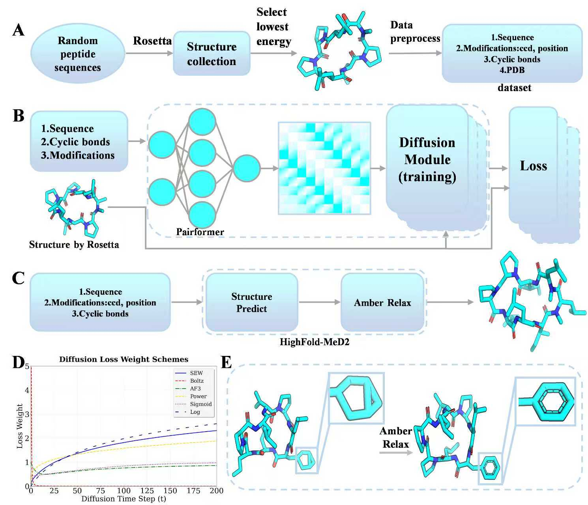

# HighFold-MeD2
HighFold-MeD2: An Enhanced Boltz-2 Model for Accurate Structure Prediction of N-Methylated and D-Amino Acid Cyclic Peptides



## Installation
All working code depends on the Boltz-2 model. Please install Boltz-2 first.
```
conda create -n highfold_med2 python=3.12
git clone https://github.com/jwohlwend/boltz.git
cd boltz; pip install -e .[cuda]
```
Then install HighFold-MeD2.
```
git clone https://github.com/zhengyuxiang/HighFold-MeD2.git
cd HighFold-MeD2
pip install -e .
```

## Usage
```
python scripts/run_data_process.py
```
```
python scripts/run_finetune.py
```
```
python scripts/run_eval_dadaset.py
```
## Citation
comming soon...